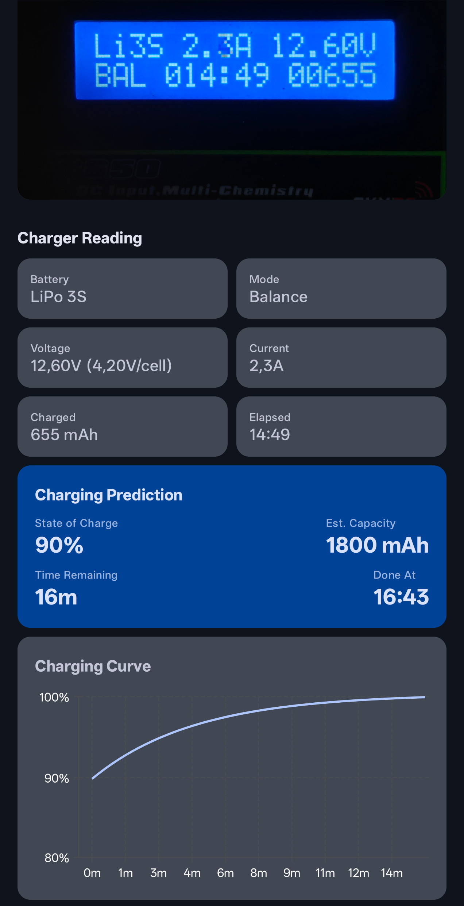

# B6 Companion

AI driven implementation as is nowadays the trend...

Point your phone at a SkyRC B6-series LiPo charger, take a photo, and get a
state-of-charge estimate, time-until-done prediction, and a SoC curve from
now to full.

## How it works

1. **OCR** (ML Kit) reads the charger's LCD text.
2. **Parser** extracts cell count, voltage, current, mode, elapsed time, and
   delivered mAh, including tolerance for typical LCD misreads.
3. **Estimator** predicts SoC and time remaining:
   - CC phase: SoC from IR-corrected OCV, remaining time from `(target − current) / I_cc`
   - CV phase: SoC from the integral of the remaining current decay to `I_term`
     (`remaining_mAh = τ·(I_now − I_term)`), remaining time from `τ·ln(I_now/I_term)`
   - Per-cell IR scales with capacity rather than a fixed constant
4. **Chart** plots SoC against time, from now to the predicted completion.

## Building

Requires Android Studio with a configured Android SDK. Open the project and
run the `app` configuration on a device or emulator.
